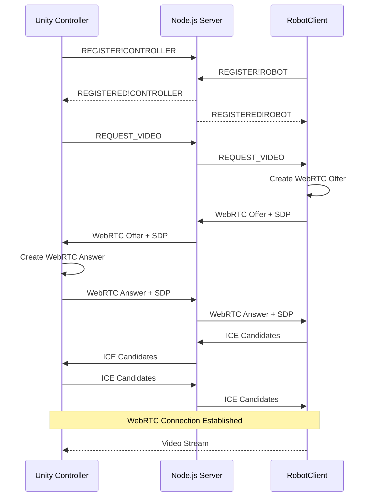

# WebRTC Video Streaming Integration Guide

## 🎯 Overview

This guide will help you set up and test WebRTC video streaming between your RobotClient (C#) and Unity application through your Node.js server.

## 📋 Prerequisites

### RobotClient Requirements
- ✅ Linux OS (Ubuntu/Debian preferred)
- ✅ SIPSorcery packages (already installed)
- ✅ FFmpeg installed (`sudo apt install ffmpeg`)
- ✅ Camera/webcam connected to Linux (usually `/dev/video0`)
- ✅ .NET 8.0

### Unity Requirements
- Unity 2022.3 LTS or newer
- WebSocketSharp package (already installed)
- Camera permissions for testing

### Server Requirements
- ✅ Node.js server with WebRTC signaling (already configured)
- ✅ TURN server setup (already implemented)

## 🚀 Step-by-Step Setup

### 1. RobotClient Setup

The RobotClient now includes:
- ✅ `VideoStreamingThread.cs` - FFmpeg integration and WebRTC peer connection
- ✅ `FFmpegProcessing.cs` - Camera capture via FFmpeg (Linux)
- ✅ `WebSocketClient.cs` - WebRTC signaling support
- ✅ `DualThreadRobotService.cs` - Integrated video streaming thread

**Setup Camera on Linux:**
```bash
# Проверить доступные камеры
ls /dev/video*
# Проверить информацию о камере
v4l2-ctl --list-devices
# Проверить поддерживаемые форматы
v4l2-ctl --list-formats-ext -d /dev/video0
```

**Test the RobotClient:**
```bash
cd RobotClient/RobotClient

# С камерой по умолчанию /dev/video0
dotnet run

# С конкретной камерой
dotnet run /dev/video1

# С тестовым источником (без камеры)
dotnet run -test

# С кодеком VP8
dotnet run -vcodec vp8

# Комбинированные параметры
dotnet run /dev/video0 -vcodec h264
```

Expected output:
```
🤖 Двухпоточный сервис робота инициализирован (Linux/FFmpeg)
📡 Сервер: ws://your-server:8080
🔌 Подключение к серверу...
✅ WebSocket подключен
📝 Регистрация как ROBOT...
✅ Робот успешно зарегистрирован
🎮 Запуск потока управления роботом...
📹 Запуск потока трансляции видео (Linux/FFmpeg)...
🎬 Инициализация FFmpeg для захвата видео...
📷 Используется камера: /dev/video0
🎬 Запуск FFmpeg с командой:
ffmpeg -f v4l2 -i /dev/video0 -video_size 640x480 -framerate 30 -vcodec h264 ...
✅ FFmpeg инициализирован успешно
📺 Видео формат: H264
✅ Видео поток готов к WebRTC соединениям
```

### 2. Unity Setup

#### A. Add WebRTC Video Manager to Scene

1. Create an empty GameObject named "WebRTCVideoManager"
2. Add the `WebRTCVideoManager.cs` script
3. Configure the UI components:

```
WebRTCVideoManager GameObject:
├── VideoDisplay (RawImage) - for video rendering
├── RequestVideoButton (Button) - to request video stream
├── StatusText (Text) - for status messages
└── ConnectionStatusText (Text) - for connection status
```

#### B. UI Setup Example

Create a Canvas with these UI elements:

```xml
Canvas
├── VideoPanel
│   ├── VideoDisplay (RawImage)
│   │   └── Aspect Ratio Fitter (16:9)
│   └── VideoControls
│       ├── RequestVideoButton (Button)
│       ├── StopVideoButton (Button)
│       ├── StatusText (Text)
│       └── ConnectionStatusText (Text)
```

#### C. Script Integration

1. Assign UI components to the WebRTCVideoManager script
2. Set video parameters:
   - Width: 640
   - Height: 480
   - Target FPS: 30

### 3. Testing Workflow

#### Basic Connection Test

1. **Start the Node.js Server:**
   ```bash
   cd server
   npm start
   ```

2. **Start the RobotClient:**
   ```bash
   cd RobotClient/RobotClient
   dotnet run
   ```
   
   Wait for: "✅ Видео поток готов к WebRTC соединениям"

3. **Start Unity:**
   - Play the scene
   - Wait for: "WebRTC Video Manager инициализирован"
   - Click "Request Video" button

#### Expected Flow



## 🔧 Troubleshooting

### Common Issues

#### 1. Camera Not Found (Linux)
```
❌ FFmpeg error: Cannot find camera device
```
**Solution:**
```bash
# Проверить доступные камеры
ls /dev/video*

# Проверить разрешения
ls -la /dev/video*

# Добавить пользователя в группу video
sudo usermod -a -G video $USER

# Перезагрузить сессию или перезапустить
newgrp video

# Тестировать камеру
ffmpeg -f v4l2 -list_formats all -i /dev/video0

# Использовать тестовый источник
dotnet run -test
```

#### 2. WebSocket Connection Failed
```
❌ Таймаут подключения к серверу
```
**Solution:**
- Check server is running
- Verify server URL and port
- Check firewall settings

#### 3. WebRTC Offer/Answer Failed
```
❌ Ошибка создания WebRTC offer
```
**Solution:**
- Check SIPSorcery packages
- Verify camera initialization
- Check network connectivity

#### 4. Unity WebSocket Not Connected
```
❌ WebSocket не подключен
```
**Solution:**
- Check Unity WebSocket client initialization
- Verify server address in Unity script
- Check Unity console for connection errors

### Debug Logs

#### RobotClient Debug Levels
```csharp
Console.WriteLine("🔌 WebSocket подключен");          // Connection
Console.WriteLine("📷 Камера инициализирована");      // Camera  
Console.WriteLine("📡 WebRTC сигнал");                // Signaling
Console.WriteLine("🧊 ICE кандидат");                 // ICE
Console.WriteLine("🔗 WebRTC состояние соединения");  // Connection State
```

#### Unity Debug Levels
```csharp
Debug.Log("📹 Запрос видео потока");          // Video Request
Debug.Log("📡 WebRTC сигнал");               // Signaling
Debug.Log("✅ WebRTC соединение установлено"); // Connection
```

## 🧪 Testing Scenarios

### Scenario 1: Basic Video Request
1. Start all components
2. Click "Request Video" in Unity
3. Verify WebRTC signaling exchange
4. Check for connection establishment

### Scenario 2: Multiple Connections
1. Stop video stream
2. Request video again
3. Verify clean disconnection and reconnection

### Scenario 3: Network Issues
1. Disconnect network during streaming
2. Reconnect network
3. Test automatic reconnection

### Scenario 4: Camera Switching
1. Disconnect current camera
2. Connect different camera
3. Restart RobotClient
4. Test video streaming with new camera

## 📊 Performance Monitoring

### Key Metrics to Monitor

#### RobotClient
- Camera FPS: Target 30 FPS
- WebRTC bandwidth usage
- CPU usage during encoding
- Memory usage

#### Unity
- Video rendering FPS
- UI responsiveness
- WebSocket message latency
- Memory usage

#### Server
- WebSocket connections: 2 active (robot + controller)
- Message throughput
- TURN server usage
- Memory and CPU usage

## 🔄 Next Steps for Production

### 1. Real WebRTC Implementation
- Replace simulation with actual Unity WebRTC package
- Implement proper video decoding in Unity
- Add adaptive bitrate control

### 2. Error Handling
- Connection retry logic
- Graceful degradation
- User feedback improvements

### 3. Performance Optimization
- Video quality settings
- Network adaptation
- Bandwidth monitoring

### 4. Additional Features
- Audio streaming support
- Multiple camera support
- Recording capabilities
- Quality settings UI

## 📁 File Structure Summary

```
RobotControl/
├── RobotClient/RobotClient/
│   ├── Core/
│   │   ├── VideoStreamingThread.cs        ✅ UPDATED (Linux/FFmpeg)
│   │   ├── WebSocketClient.cs             ✅ UPDATED  
│   │   └── DualThreadRobotService.cs      ✅ UPDATED
│   └── Video/
│       └── FFmpegProcessing.cs            ✅ UPDATED (Camera support)
├── Assets/Scripts/Services/
│   ├── WebSocket/
│   │   └── WebSocketClient.cs             ✅ UPDATED
│   └── RobotVideoProcessing/
│       ├── WebRTCVideoService.cs          ✅ NEW
│       ├── WebRTCVideoManager.cs          ✅ NEW
│       └── WebRTCMessages.cs              ✅ NEW
└── server/src/services/
    └── WebRTCSignalingService.js          ✅ EXISTING
```

## 🎉 Success Criteria

Your WebRTC implementation is working correctly when:

1. ✅ RobotClient successfully initializes camera
2. ✅ Unity connects to WebSocket server
3. ✅ Video request triggers WebRTC offer creation
4. ✅ Signaling exchange completes without errors
5. ✅ WebRTC connection state shows "connected"
6. ✅ Unity displays video texture (even if simulated)
7. ✅ Connection can be cleanly stopped and restarted

Ready to test your WebRTC video streaming setup! 🚀 